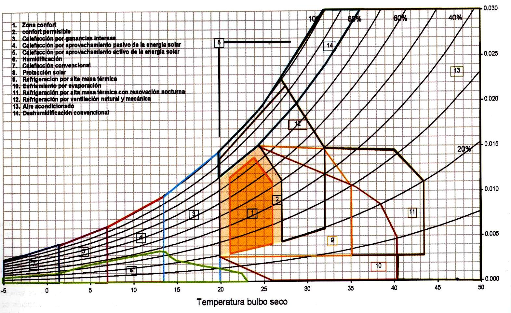

Climograma de Baruch Givoni

 

INSTITUTO TECNOLOGICO Y DE ESTUDIOS SUPERIORES DE MONTERREY 
ESCUELA DE ARQUITECTURA, ARTE Y DISE&NtildeO 

DEPARTAMENTO DE ARQUITECTURA.

Dise&ntildeo Bioclim&aacutetico / Sostenibilidad Ambiental.
Nombre:_______________________________ 
Fecha:________________________________ 
Grupo:________________________________ 

 El climograma de Givoni se basa en las condiciones de temperatura y humedad exteriores, considerando las características del edifcio como interfase entre el ser humano y el exterior. 

Las bases de este climograma se encuentran en el diagrama psicrométrico, en el que cualquier estado de aire ambiental viene definido en un punto de función de la temperatura de bulbo seco, humedad relativa y demás parámetros del aire en esas condiciones. 
 Al igual que el diagrama de Olgyay, planea las condiciones de confort higrotérmico para el ser humano en función de la temperatura y la humedad. Como temperatura utiliza la temperatua de bulbo seco, que es la habitualmente proporcionada por los observatorios metereológicos. 

Los límites de la zona de Confort establecidos por Givoni difieren ligeramente de los planteados por Olgyay. Se describen a continuación las zonas y estrategias propuestas en el climograma de Givoni.
 Confort 
de 21 a 26ºC de temperatura.
de 20 a 75% de humedad relativa. 
 Confort permisible 
de 20 a 27ºC de temperatura.
de 20 a 80% de humedad relativa. 
Dentro de las zonas y estrategias propuestas por Givoni, se puedeverificar, dada la superposición de zonas, la compatibilidad de diferentes estrategias de obtención del conort térmico. 
14 son las estrategias bioclimáticas ubicadas en el diagrama de Givoni: 
CALEFACCIÓN: (Desplazamiento hacia la zona fría),

 Calefacción por ganancias internas (3)
 Calefacción por aprovechamiento pasivo de la energía solar. (4)
 Calefacción por aprovechamiento activo de la energía solar. (5)
 Humidificación (6)
 Calefacción convencional. (7) 

PROTECCIÓN SOLAR: (Desplazamiento hacia la zona cálida),

Protección solar. (8)

ENFRIAMIENTO: (Desplazamiento hacia la zona cálida),

 Refrigeración por alta masa térmica. (9)
 Enfriamiento por evaporación. (10) 
 Refrigeración por alta masa térmica con renovación nocturna. (11)
 Refrigeración por ventilación natural y mecánica. (12)
 Aire acondicionado. (13)
 Deshumidificación convencional. (14)

Desplazamiento hacia la zona fría: 

 Calefacción por ganancias internas 
Aplicable en un rango de temperaturas entre 13.5°C y 20°C y en todos los rangos de humedades. 
 Confort térmico
Aplicable en un rango de temperaturas entre 7°C y 13.5°C y en todos los rangos de humedades. 
 Calefacción por aprovechamiento de la energía solar.
Aplicable en un rango de temperaturas entre 1.5°C y 7°C y en todos los rangos de humedades. 
 Calefacción convencional.
Aplicable en temperaturas inferiores a 1.5°C en todos los rangos de humedades.
 Humidificación.

Desplazamiento hacia la zona cálida: 

 Protección solar.
Aplicable para temperaturas superiores a 21°C (semejante a los límites de linea de sombra propuestos por Olgyay)en todos los rangos de humedades.
 Refrigeración por alta masa térmica.
Aplicable desde temperaturas de 20°C hasta temperaturas de 36°C en un rango de humedad veriable desde el 8% al 80%.
 Enfriamiento evaporativo.
Aplicable desde temperaturas de 20°C hasta 40.5°C en un rango de humedad variable desde el 0% al 80%.
 Refrigeración por alta masa térmica con renovación nocturna.
Aplicable desde temperaturas de 33.5°C hata 43.5°C en un rango de humedad variable desde el 8% al 50%.
 Refrigeración por ventilación natural y mecánica.
Aplicable desde temperaturas de 20°C hasta 32°C en un rango de humedad variable desde el 20% al 95%.
 Aire acondicionado.
El rango de aplicación oscila desde temperaturas cálidas y muy húmedas hasta temperaturas muy altas aún con humedades menores. 
 Deshumidificador convencional.
Aplicable con humedades relativas superiores a 80% con temperaturas superiores a 20°C.

 
 
  
 
     &nbsp 
  

 
 

Se pide a continuación contestar ampliamente a las siguientes preguntas: 

1.- Explica AMPLIAMENTE el uso del Diagrama de Givoni.
2.- Menciona los límites de la Zona de Confort de Givoni.
3.- Menciona las 14 estrategias bioclimáticas descritas en el Diagrama de Givoni.
4.- Encuentra alguna ciudad en el mundo que utilice: Refrigeración por alta masa térmica, la cual sea aplicable desde temperaturas de 20°C hasta temperaturas de 36°C en un rango de humedad veriable desde el 8% al 80%. 
5.- Resuelve el Diagrama de Givoni para Monterrey.
6.- Resuelve el Diagrama de Givoni para Sonora.
7.- Resuleve el Diagrama de Givoni para Veracruz. 
8.- ¿Qué significa deshumidificación convencional ? y ¿Entre que temperaturas utilizo deshumidificador?..
9.- Explica como funciona la refrigeración por alta masa térmica. 
10.-Menciona y explica al menos 4 diferencias básicas del diagrama de Olgyay y de el diagrama de Givoni.

 

 

 
 

