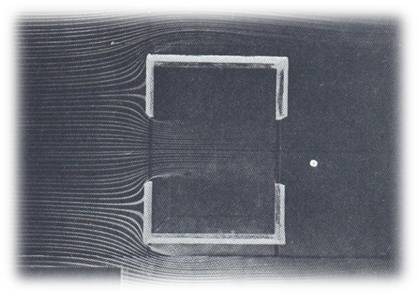
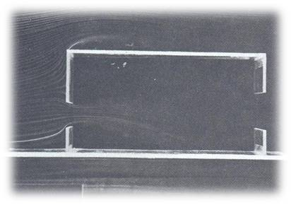
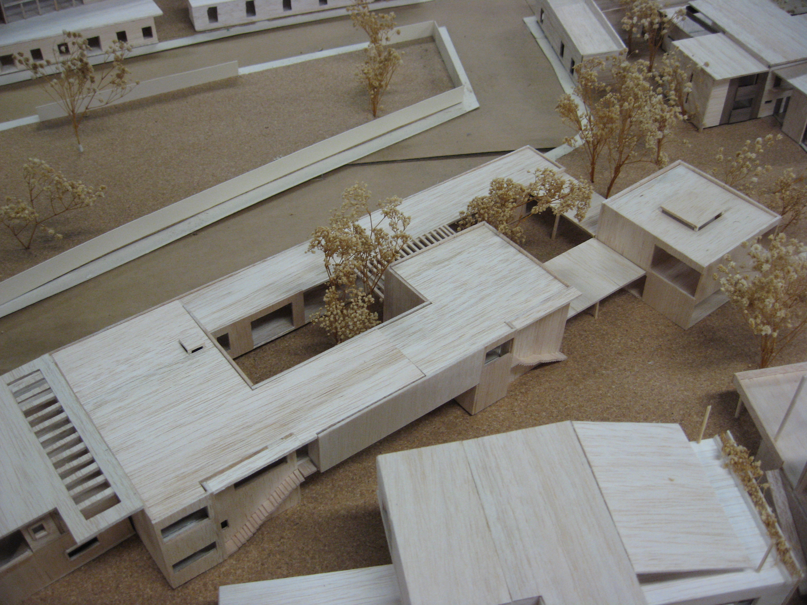
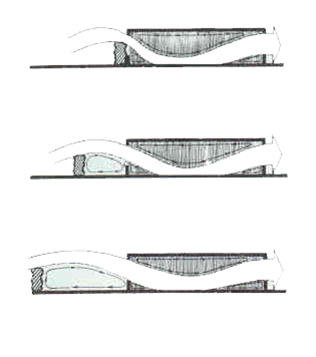

Ventilaci&oacuten 

 
 
INSTITUTO TECNOLÓGICO Y DE ESTUDIOS SUPERIORES DE MONTERREY 
ESCUELA DE ARQUITECTURA, ARTE Y DISEÑO 

DEPARTAMENTO DE ARQUITECTUA.

 Sustentabilidad Ambiental/Diseño Bioclim&aacutetico 
Nombre:_______________________________ 
Fecha:________________________________ 
Grupo:________________________________ 

Arq. Edmundo José Reyes Guzmán.

 Se pide: 

Contestar amplia y detalladamente a las siguientes preguntas: 

1.- ¿Qu&eacute significa sotovento y barlovento? . . .
2.- ¿C&oacutemo puedo provocar flujos de ventilaci&oacuten en el interior de los edificios?..
3.- ¿C&oacutemo puedo provocar flujos de ventilaci&oacuten en el interior de los edificios cuando hay muros divisorios que obstruyen la ventilaci&oacuten interna?... 
"Realiza un esquema en planta.
4.- ¿Qu&eacute es y c&oacutemo funciona el Efecto Venturi en arquitectura?... 
"Realiza un esquema en corte.
5.- ¿Qu&eacute significa ventilaci&oacuten cruzada?... 
"Realiza un esquema en corte.
6.- Para el per&iacuteodo de verano... ¿Qu&eacute es m&aacutes importante la cantidad de aire intercambiado o la velocidad del &aacuteire?... 
7.- ¿Cu&aacutel es la posición y/o altura ideal de la ventana para la entrada del aire? ...
8.- ¿Cu&aacutel es la posición y/o altura ideal para la salida de aire?...
9.- Realiza un esquema en corte que apoye tus anteriores respuestas 6 y 7. 
10.- Explica alg&uacuten instrumento de medici&oacuten en el mercado que sea utilizado para medir la velocidad del aire y/o direcci&oacuten del viento. (Investiga tu respuesta en internet y cita tu fuente bibliogr&aacutefica). 

 

 

 

 
 

 

 

