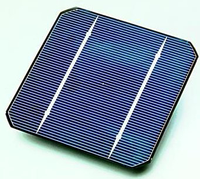
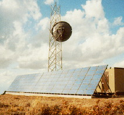
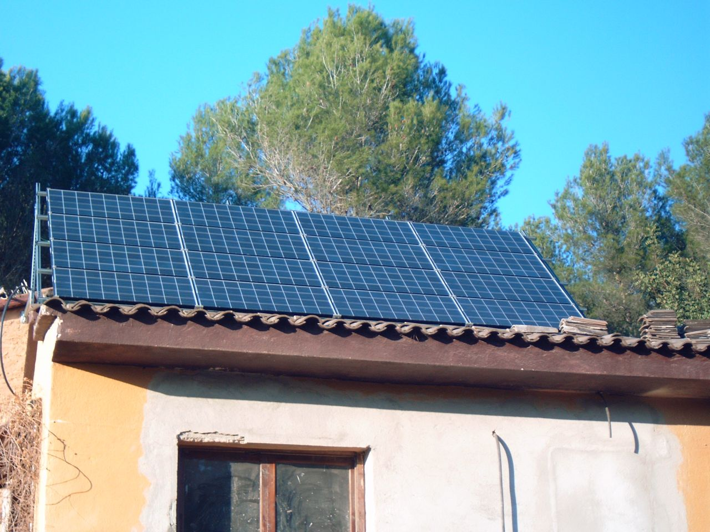
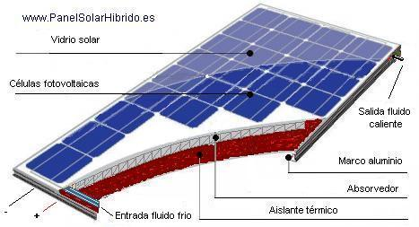
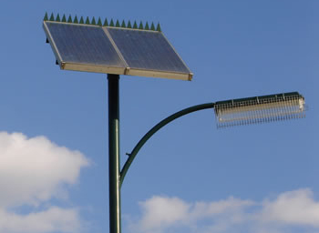

Energ&iacutea fotovoltaicas. 

 
 
INSTITUTO TECNOL&OacuteGICO Y DE ESTUDIOS SUPERIORES DE MONTERREY 
ESCUELA DE ARQUITECTURA, ARTE Y DISENO 

DEPARTAMENTO DE ARQUITECTURA

 Materias: &nbsp&nbspDise&ntildeo Bioclim&aacutetico ar2017 y Sostenibilidad Ambiental ar2002. 
Arq. Edmundo Jos&eacute Reyes Guzm&aacuten. 
Nombre:_______________________________ 
Fecha:________________________________ 
Grupo:________________________________ 

La energ&iacutea solar fotovoltaica es un tipo de electricidad renovable (energ&iacutea el&eacutectrica, -voltaica) obtenida directamente de los rayos del sol (foto-) gracias a la foto-detecci&oacuten cu&aacutentica de un determinado dispositivo; normalmente una l&aacutemina met&aacutelica semiconductora llamada c&eacutelula fotovoltaica, o una deposici&oacuten de metales sobre un sustrato llamada capa fina. Se encuentran tambi&eacuten en fase de laboratorio algunos m&eacutetodos org&aacutenicos. 

&iquest A qu&eacute se llama FOTOVOLTAICO?. . . 

Es el desarrollo de un semiconductor de estado s&oacutelido, que convierte la luz solar directamente en electricidad. 
Una fuente fotovoltaica (generalmente llamada Celda Solar), consiste en: 

&Oacutebleas de materiales semiconductores con diferentes propiedades electr&oacutenicas. 
En una celda policristalina, el volumen principal de material es silic&iacuteo alterado (dopado) con una peque&ntildea cantidad de boro, que le da una caracter&iacutestica positiva o tipo-p. Una delgada &oacuteblea en el frente de la celda es alterada con f&oacutesforo para darle una característica negativa o tipo-n. La interfase entre estas dos &oacutebleas contienen un campo el&eacutectrico y es llamada Uni&oacuten.
 La luz consiste de part&iacuteculas llamadas fotones, cuando la luz choca sobre la celda solar, cada uno de los fotones es absorbido en la regi&oacuten de uni&oacuten liberando electrones de cristal de silicio. Si el fot&oacuten tiene suficiente energ&iacutea, los electrones ser&aacuten capaces de vencer el campo el&eacutectrico de la uni&oacuten y moverse a trav&eacutes del silicio y hasta un circuito externo. 
Cuando fluyen a trav&eacutes de un circuito externo, pueden proporcionar energ&iacutea para hacer un trabajo (cargar bater&iacuteas, mover motores, encender l&aacutemparas, etc.). 
 La corriente el&eacutectrica continua, que proporcionan los m&oacutedulos fotovoltaicos se puede transformar en corriente alterna mediante un aparato electr&oacutenico llamado inversor e inyectar en la red el&eacutectrica (para venta de energ&iacutea) o bien en la red interior (para autoconsumo). 

El proceso, simplificado, ser&iacutea el siguiente: 
Se genera la energ&iacutea a bajas tensiones (380-800 V) y en corriente continua. Se transforma con un inversor en corriente alterna. En plantas de potencia inferior a 100kW se inyecta la energ&iacutea directamente a la red de distribuci&oacuten en baja tensi&oacuten (230V). Y para potencias superiores a los 100kW se utiliza un transformador para elevar la energ&iacutea a Media tensi&oacuten (15 ó 25 kV) y se inyecta en las redes de transporte.
 En entornos aislados, donde se requiere poca potencia el&eacutectrica y el acceso a la red es dif&iacutecil, como se&ntildealizaci&oacuten de v&iacuteas p&uacuteblicas, estaciones meteorol&iacutegicas o repetidores de comunicaciones, se emplean las placas fotovoltaicas como alternativa econ&oacutemicamente viable. Para comprender la importancia de esta posibilidad, conviene tener en cuenta que aproximadamente una cuarta parte de la poblaci&oacuten mundial todav&iacutea no tiene acceso a la energ&iacutea el&eacutectrica. 
La Energ&iacutea el&eacutectrica puede generarse directamente a partir de la energ&iacutea solar. Las celdas fotovolt&aacuteicas se fabrican con silicio, el segundo elemento m&aacutes abundante de la corteza terrestre, el mismo material semiconductor usado en las computadoras.
 &iquestC&oacutemo funciona &eacute sistema?....

Al incidir la radiaci&oacuten solar sobre la celda fotovoltaica, la energ&iacutea solar se transmite a los electrones del semiconductor, al chocar un fot&oacuten de luz con un &aacutetomo del monocristal con suficiente energ&iacutea. 

As&iacute un electr&oacuten mueve otro electr&oacuten en el lugar del choque, y un electr&oacuten inmediato deja su lugar para ser ocupado por otro. Y por consiguiente, se crea una corriente el&eacutectrica. 
Los electrones son excitados por la luz y se mueven a trav&eacutes del silicio, este es conocido como el efecto fotovolt&aacuteico y produce una corriente el&eacutectrica directa. 
Las celdas fotovolt&aacuteicas no tienen partes m&oacuteviles, son virtualmente libres de mantenimiento, y tienen una vida &uacutetil de 20 a 30 a&ntildeos.

 

 

 

 

 
 

 

 
Los paneles fotovoltaicos se dividen en:

 Cristalinas 
 Mono cristalinas: se componen de secciones de un &uacutenico cristal de silicio (Si) (reconocibles por su forma circular u octogonal, donde los 4 lados cortos, si se puede apreciar en la imagen, se aprecia que son curvos, debido a que es una c&uacutelula circular recortada). 
 Poli cristalinas: cuando est&aacuten formadas por pequeñas part&iacuteculas cristalizadas.
 Amorfas: cuando el silicio no se ha cristalizado.
 

&iquestDe que tama&ntildeo tiene que ser un sistema de energ&iacutea solar?... 
Para determinar el tama&ntildeo adecuado de un sistema de energ&iacutea solar, es necesario conocer cu&aacutel ser&aacute el consumo corriente. 

A continuaci&oacuten los 4 pasos que deben seguirse para descubrir cu&aacutel ser&aacute el tama&ntildeo m&aacutes adecuado al sistema de acuerdo a sus requerimientos particulares. 
1.- Calcular el consumo total en watts, en base a las aplicaciones de energ&iacutea y sus consumos de corriente.
2.- Balancear el sistema fotovoltaico seg&uacuten el consumo de watts-horas en cada aplicaci&oacuten y determinar cuantas horas se usa cada aplicaci&oacuten por d&iacutea.
3.- Buscar la latitud geogr&aacutefica del &aacuterea donde se instalar&aacute el sistema con el mapa de radiaci&oacuten solar, esto permitir&aacute estimar la producci&oacuten de corriente al d&iacutea. 
4. Con la informaci&oacuten de los pasos 2 y 3 se puede determinar el tama&ntildeo adecuado para el sistema de energ&iacutea solar.

CUESTIONARIO:
Responde seg&uacuten el presente escrito a las sigueientes preguntas: 
Nota: Es importante que imprimas en papel ecol&oacutegico &eacutesta actividad y que la puedas grapar como anexo a la misma.
 
Menciona y explica... &iquestA que se llama Fotovoltaico?...
Explica las diferentes funciones del boro y del f&oactuesforo en una celda fotovoltaica.
&iquestDe d&oacutende se obtiene el silicio policristalino?... 
&iquestCu&aacutel es la tarea principal de la regi&oacuten de Uni&oacuten en una celda fotovoltaica?...
&iquestCu&aacutel es la diferencia entre corriente el&eacutectrica y alterna?...
&iquestCoacutemo se mueven los electrones y los fotones en una celda fotovoltaica?...
Menciona en qu&eacute se dividen los paneles fotovoltaicos.
&iquestDe que tamaño tiene que ser un sistema de energ&iacute solar?...
&iquestCu&aacuteles son los 4 pasos que se deben de seguir para conocer el tama&ntildeo m&aacutes adecuado para un sistema fotovoltaico?...

  

 Nota: &iquest Te interesan&eacutestos temas en particular?... Existen cursos a distancia con Espa&ntildea (Sevilla), para cursar un diplomado en:Curso de Proyectista Instalador de Energ&iacutea Solar (Fotot&eacutermica y Fotovoltaica. Tienes que leer las normas y llenar un formulario para estudiantes latinoamericanos. Por otra parte, el precio total del curso para alumnos residentes en pa&iacuteses americanos es de 1750 d&oacutelares USA,
En dicho coste est&aacuten inclu&iacutedos absolutamente todos los conceptos, as&iacute como la expedici&oacuten y env&iacuteo del Diploma final. 

