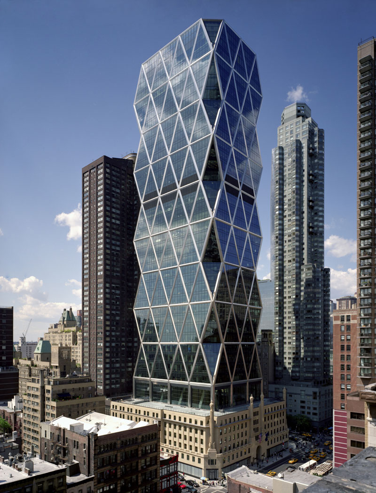
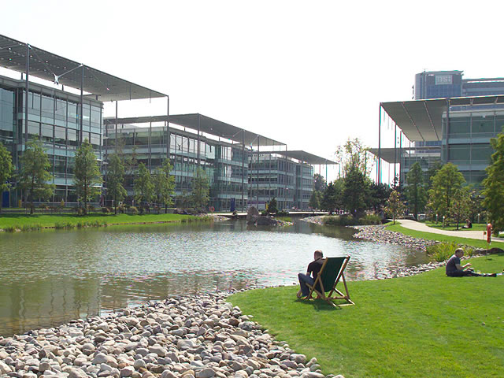
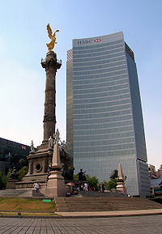
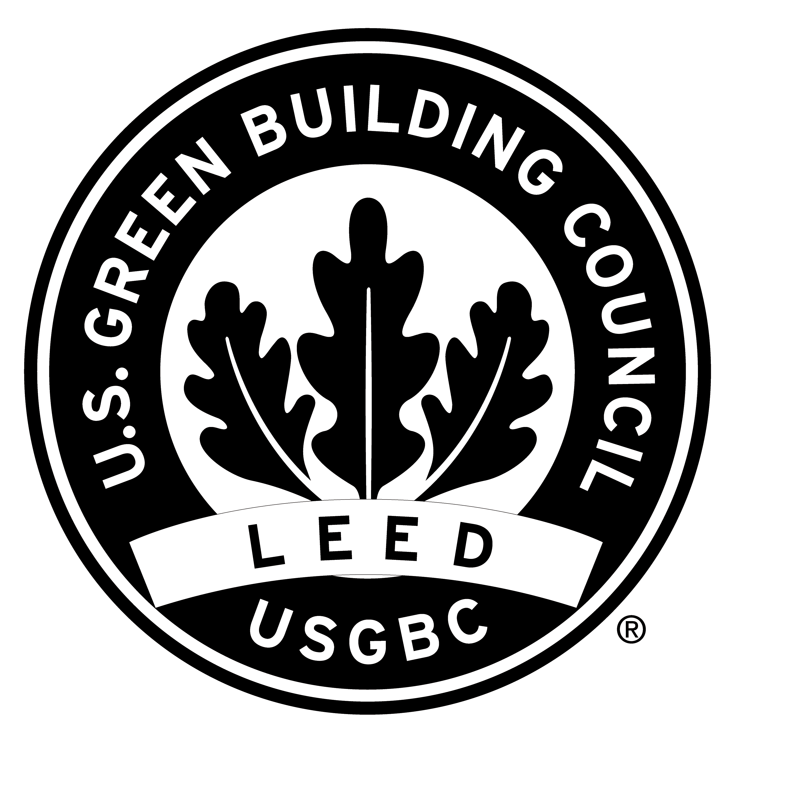

LEED 
 

 

INSTITUTO TECNOLÓGICO Y DE ESTUDIOS SUPERIORES DE 
 MONTERREY
ESCUELA DE ARQUITECTURA, ARTE Y 
 DISEÑO
DEPARTAMENTO DE 
 ARQUITECTURA
Arq. 
 Edmundo José Reyes Guzmán.
 
SOSTENIBILIDAD 
 AMBIENTAL
LEED en México
Nombre:______________________   Fecha:__________________ 
 Frecuencia:_________
 
LEED 
 (Leadership in Energy & Environmental Design) es un sistema de 
 certificación de edificios sostenibles, desarrollado por el Consejo de la 
 Construcción Verde de Estados Unidos  (US Green Building Council) Fue 
 inicialmente implantado en el año 1998, utilizándose en varios países 
 desde entonces.
Se compone de un conjunto de normas sobre la 
 utilización de estrategias encaminadas a la sostenibilidad en edificios de 
 todo tipo. Se basa en la incorporación en el proyecto de aspectos 
 relacionados con la eficiencia 
 energética, el uso de 
 energías 
 alternativas, la mejora de 
 la calidad ambiental interior, la eficiencia del 
 consumo de agua, el 
 desarrollo sostenible de los espacios libres de la parcela y la selección 
 de materiales. Existen cuatro niveles de certificacion: 
certificado (LEED Certificate), 
 
plata (LEED Silver), 
 
oro (LEED Gold) 
 
platino (LEED 
 Platinum).
En general, la metodología de todos los 
 sistemas de evaluación LEED es la misma. Se establecen varias categorías, 
 típicamente siete: 
Sustainable 
 Sites 
 (parcelas sostenibles),
 Water Efficiency 
 (ahorro de agua), 
Energy 
 and Atmosphere 
 (eficiencia energética), 
Materials 
 and Resources 
 (materiales),
 Indoor Environmental Quality 
 (calidad de aire interior), 
Innovation 
 in Design 
 (Innovación en el proceso de diseño) 
y 
 Regional Priorities 
 (prioridades regionales). 
Dentro de estos capítulos se incluye una serie 
 de requisitos de cumplimiento obligatorio (Prerequisites) y créditos de 
 cumplimiento voluntario (credits). La justificación del cumplimiento de 
 dichos parámetros otorga una serie de puntos, en función de los cuales se 
 otorga el grado de la certificación (LEED Certificate, Silver, Gold o 
 Platinum).
El proceso de certificación en las modalidades 
 más habitules (edificios de nueva planta) tiene lugar durante las fases de 
 proyecto y obra del edificio, obteniéndose la certificación al final de la 
 fase de obra. Si bien no existe ningún requisito para abordar la 
 certificación, es habitual que a los agentes del proyecto se incorpore un 
 asesor especializado.
Además de la certificación de edificios, el 
 USGBC dispone de programas de formación y titulación de profesionales, 
 mediante las titulaciones LEED Accredited Professional (LEED AP), y LEED 
 Green Associate (LEED GA).

 

Hearst Tower. Arch. Sr. Norman 
 Foster. N.Y.

Torre 
 HSBC.  Arq. Helmuth Obata Kassanaum. México, 
 D.F.

 

Centro Tecnológico Palmas Altas. Arq. 
 Richard Rogers, 
 España.                                         
 

 
 

World Trade 
 Center.  Arch. David Shankbone. NY
 

 

En México existen 12 proyectos 
 registrados para obtener la certificación LEED. 
 
 

  
   "Es 
 importante reconocer que 
 es un tema nuevo, 
 y por otro lado faltaban ejemplos 
 que pudiera ilustrar que esto sí es posible dice 
 el Ing. César Ulises
Treviño, presidente del 
 Consejo Mexicano de Edificación 
 Sustentable"...
 
En México sólo el Centro Nacional de 
 Negocios de Chihuahua y el edificio de HSBC en Reforma tienen el 
 certificado LEED. 

El edificio HSBC, ubicado en Paseo de 
 la Reforma, logró la primera certificación Oro a nivel América Latina. 
 Cuenta con32 pisos y 78 mil metros cuadrados de construcción. Alberga a 
 2,800 empleados. Existen 10 pisos de estacionamiento, 20 de oficinas y dos 
 penthouse; un helipuerto y una azotea verde en su terraza. El costo total 
 del proyecto fue de 160 millones de dólares. El sobrecosto por los 
 materiales y las instalaciones verdes fue de 1.6% y 6.7% para recursos 
 humanos adicionales. 
Logró reducir 20% su consumo de 
 energía, 76% el de agua potable y evita emisiones de CO2 por1,229 
 toneladas al año.
 
El  Green Building Certification 
 Institute www.gbci.org: 
 
Otorga las credenciales profesionales para la 
 certificación en los siguientes 
rubros:
a.- LEED Green 
 Associate.
b.- LEED AP Building Design & 
 Construction.
c.- LEED AP 
 Homes.
d.- LEED AP Neighborhood 
 Development.
e.- LEED AP Operations & 
 Maintenance
f.-  
 LEED AP Interior Design & 
 Construction.
g.- LEED 
 Fellow
La guía para el examen se encuentra en éste link: 
 
http://www.gbci.org/main-nav/professional-credentials/exam-guide/about/exam-guide-about.aspx 
LIBROS  ebook GRATIS: 
 http://www.usgbc.org/DisplayPage.aspx?CMSPageID=1983

Project 
 Management Guide for Schools

Printable 
 e-book: FREE

Printable 
 e-book: FREE

N/A

N/A

N/A

Green 
 Existing Schools workbook

Printable 
 e-book: FREE

Printable 
 e-book: FREE

N/A

N/A

N/A

Green 
 Venue Selection Guide

Printable 
 e-book: FREE

Printable 
 e-book: FREE

N/A

N/A

N/A

Paid-from-Savings 
 Guide to Green Existing Buildings – executive 
 summary

Printable 
 e-book: FREE

Printable 
 e-book: FREE

N/A

N/A

N/A
EL GBCI pide horas de voluntariado para poder ganar CREDITOS 
 
Ya que los créditos te sirven para tu 
 certificación:
 
VOLUNTEER: EARNING 
 CE HOURS
If chosen to 
 participate as a volunteer subject matter expert, you are eligible to 
 report the following continuing education (CE) hours using the following 
 guidelines: 
·         
 0.5 CE hours 
 for each 3 hours of WebEx; 
 
·         
 1.5 CE hours 
 for a 1-day meeting; 
·         
 3 CE hours 
 for a 2-day meeting; and/or 
 
·         
 4 CE hours 
 for a meeting more than 2 days 
 
 
Please 
 note that 4 CE hours is the maximum number of hours attainable within your 
 two-year reporting period in committee and volunteer work. 
 
 PREGUNTAS: 
I. Se pide a continuación responder a las 
 siguientes preguntas: 
1.-¿Qué significa 
 LEED?..
2.-¿Cuál es el objetivo principal que busca 
 LEED en los proyectos, además de que sean 
 sustentables?...
3.- Menciona los 4 niveles que existen en la 
 Certificación LEED.
4.-¿Cuál es la función principal del  Green Building Counsil 
 (USGBC)?...
5.-¿Cuántos tipos de LEED 
 existen?...
6.-¿Dónde me inscribo para certificarme como 
 LEED?...
7.-¿Qué requisitos me piden para pedir mi 
 certificación?.
8.-¿Cuál es el primer paso que debo de dar antes de 
 mi certificación?..
9.-¿Dónde presento el examen en 
 Monterrey?..
10.- ¿Quién es el Ing. Cesar Ulises 
 Treviño?...

  

 Recomendaciones:
X 

  
 
Para entender más sobre el tema visita 
 la página: www.gbci.org: 
 
Para 
 presentar el examen LEED, visita la liga:
http://www.gbci.org/Exam-Guide/Eligibility/LEED-Green-Associate.aspx

 ¿Deseas mandar un e-mail?...

