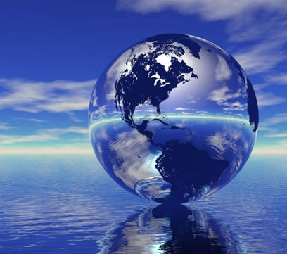
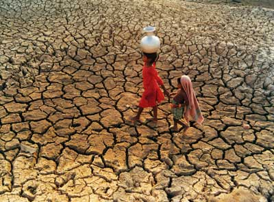
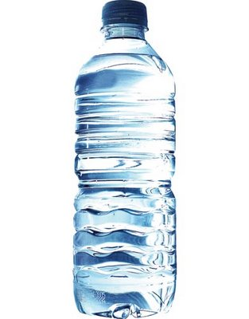

H2O

Problemática del agua en la ciudad

 

INSTITUTO TECNOLÓGICO Y DE ESTUDIOS SUPERIORES DE MONTERREY 
ESCUELA DE ARQUITECTURA, ARTE Y DISE&NtildeO 

DEPARTAMENTO DE ARQUITECTURA.

Dise&ntildeo Bioclim&aacutetico / Sostenibilidad Ambiental.
Nombre:_______________________________ 
Fecha:________________________________ 
Grupo:________________________________ 

El Agua. ¿El petróleo del futuro?... 
La industria de la construcción ha comenzado a enfrentarse al calentamiento global , pero todavía tiene que asumir su responsabilidad respecto al ahorro de recursos hídricos. 
El agua es posiblemente tan importante como la energía, y su escasez en el mundo es más urgente que el abastecimiento de energía. A diferencia de la energía el agua tiene un impacto directo sobre la salud y la producción de alimentos y aunque exista una relación entre recursos energéticos, pobreza y salud, no es de ningún modo tan directa como el caso de del agua. En África, la mayor parte de Asia e incluso algunas zonas de Europa, la escasez del agua es la carencia más fuerte. ¿Será el petróleo del futuro?....

El agua: Pobreza y salud. 
En el mundo actual 1/6 personas no tiene acceso a agua potable, casi la mitad de la población carece de instalaciones sanitarias adecuadas en sus viviendas, y cada 15 segundos muere un niño a causa de alguna enfermedad relacionada con el agua. Los arquitectos que trabajan en el extranjero deben conceder tanta importancia al consumo de agua como al de energía, y los que trabajan en África, partes de Asia y Latinoamérica descubrirán que la ingeniería hidráulica y las instalaciones sanitarias domésticas presentan problemas insalvables. En Uganda, la prioridad en estos lugares es el agua, no el petróleo: crear, en primer lugar, una red de abastecimiento de agua no contaminada y en segundo lugar, proporcionar servicios sanitarios, o asesos domésticos. 
En países como Kenia, Tanzania, Sudán y Ruanda, los arquitectos deben ocuparse de las infraestructuras hidráulicas antes de abordar la tarea de proyectar edificios. La ONG Water Aid ofrece asesoramiento sobre cómo excavar pozos, colocar tuberías y proporcionar suministro de agua a comunidades rurales remotas, pero necesita la colaboración de arquitectos, ingenieros y mecánicos sobre el terreno para instalar los equipos y supervisar las obras. En Uganda la excavación de un pozo moderno cuesta unos 1,200 €, y el agua potable genera salud, educación y métodos agrícolas más eficaces. El agua es, por tanto, la clave de una reacción en cadena que produce múltiples beneficios para algunas de las regiones más empobrecidas del mundo. 
El desplazamiento de la población humana hacia las ciudades ejerce presión sobre el suelo edificable, el agua y la energía disponible, y sobre la capacidad de tratamiento de aguas negras y residuos. Por primera vez en la historia de la humanidad en el año 2000 la población urbana supero a la población rural: de una población mundial de 6,200 millones de habitantes, es mayor el número de ellos que reside en las ciudades que en el campo. 

2010. Las causas de la disminución de agua en México.
Del libro: 390 planeta alerado. Cambios climáticos y México. Catálogo Expo Guanajuato Bicentenario 2010. Giroscopio SA de CV. México 2010.
 
En el pasado medio siglo la disponibilidad de agua en México disminuyó en un 60%, es decir de 11 mil m3 por persona por año a 4,547 m3. En el norte del país que es más árido, la disponibilidad es de 1300 m3. Once millones de personas - o sea, mas de 10%- carecen de agua potable en México. 
Esta disminución de disponibilidad de agua va asociada a la deforestación, que corresponde a un rango entre 400 y 800 mil ha anuales. En México la degradación de bosques y selvas contribuye con 12.4% a las emisiones de gases de efecto invernadero del país. Otra causa de la disminución de la disponibilidad del agua es el bajo tratamiento de aguas residuales (31% del volumen recolectado). 
 Una de las grandes paradojas en relación con el agua es que en muchas regiones el desabasto de agua es mayor cuanto más llueve. La deforestación en terrenos de laderas ocasiona erosión o deslave de suelos y la buena tierra fluye en las corrientes de agua hacia el mar y, donde hay represas de captación para alimentar a las ciudades, los sedimentos enturbian el agua que debe ser retenida y depurada antes de seguir su camino por las tuberías. 
Como consecuencia de la deforestación y el cambio climático, varias entidades del país verán incrementarse el escenario de desertificación en el que ya se encuentran (Baja California, Coahuila, Jalisco, Colima, Nayarit, Guanajuato, Querétaro, Sonora, Michoacán, Hidalgo). Los efectos sobre la producción de alimentos se verán en todo el país, tanto en productores como en consumidores. 

 
 

  

 

 La gobernabilidad del agua. 
El concepto de gobernabilidad cuando se aplica al agua, se refiere a la capacidad de la sociedad para el desarrollo sostenible y la coherencia de los recursos hídricos. 

En esencia, implica la capacidad para generar las políticas adecuadas y llevarlas a la práctica. Eso pasa por la búsqueda de consensos, la construcción de sistemas de gestión coherentes (es decir, instituciones, leyes cultura, conocimientos, prácticas y tradiciones), y la administración adecuada del sistema (lo que a su vez supone aceptación social y desarrollo de competencias). La importancia del término gobernabilidad en esta región está en buena medida asociada a los profundos cambios institucionales que han caracterizado las últimas décadas, con la consiguiente aparición de nuevas reglas del juego y organizaciones. 

PREGUNTA: 
1.- ¿Qué relación tiene el cuidado del agua con la materia de Diseño Bioclimático?... 
2.- ¿Cuál es la relación de la industria de la construcción con el calentamiento global?... 
3.- ¿Porqué se podría considerar el agua como el "petróleo del futuro"?... 
4.- ¿Los arquitectos porqué deberían de preocuparse por las infraestructuras hidráulicas y no por construir edificios?... 
5.- ¿Cuántas personas carecen en México de agua potable?...
6.- ¿Qué realción tiene la deforestación y la disponibilidad de agua en la ciudad?... 
7.- ¿Qué significa el término: Desertificación?...

 

 

¿Te importa?...

X

 
   

El agua es posiblemente tan importante como la energía, 
y su escasez en el mundo es más urgente que el abastecimiento de energía.
 A diferencia de la energía el agua tiene un impacto directo sobre la salud y la producción de alimentos y aunque exista una relación entre recursos energéticos, pobreza y salud, no es de ningún modo tan directa como el caso de del agua. En África, la mayor parte de Asia e incluso algunas zonas de Europa, 
 la escasez del agua es la carencia más fuerte. ¿Será el petróleo del futuro?.... 

// <![CDATA[ <-- For SVG support
if ('WebSocket' in window) {
(function() {
function refreshCSS() {
var sheets = [].slice.call(document.getElementsByTagName("link"));
var head = document.getElementsByTagName("head")[0];
for (var i = 0; i < sheets.length; ++i) {
var elem = sheets[i];
head.removeChild(elem);
var rel = elem.rel;
if (elem.href && typeof rel != "string" || rel.length == 0 || rel.toLowerCase() == "stylesheet") {
var url = elem.href.replace(/(&|\?)_cacheOverride=\d+/, '');
elem.href = url + (url.indexOf('?') >= 0 ? '&' : '?') + '_cacheOverride=' + (new Date().valueOf());
}
head.appendChild(elem);
}
}
var protocol = window.location.protocol === 'http:' ? 'ws://' : 'wss://';
var address = protocol + window.location.host + window.location.pathname + '/ws';
var socket = new WebSocket(address);
socket.onmessage = function(msg) {
if (msg.data == 'reload') window.location.reload();
else if (msg.data == 'refreshcss') refreshCSS();
};
console.log('Live reload enabled.');
})();
}
// ]]>

ÉXITO EN TUS TAREAS!...

